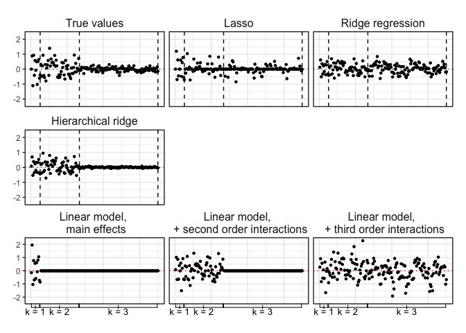

Hierarchical ridge regression
================


### The problem

Suppose we have a factorial experiment, where we want to account for
two-way and higher-order interactions. We may think that interaction
effects will be small but not exactly equal to zero, and higher-order
interactions will tend to be associated with smaller effects relative to
lower order interactions.

Accounting for all interactions in a standard linear model may be costly
in terms of variance, so we want to use some form of regularization.

**The solution proposed here:** *Hierarchical ridge regression* (or
optionally, lasso or elastic net), where penalties are increasing with
degree of complexity of interactions.

We will only consider factorial experiments here, but this idea can be
extended to account for non-linearities in dose-type treatments as well.
For our purposes, we’ll also consider only factors where there is a
natural baseline, or control, level.

We’ll consider interactions up to order
, and
 will tell us how many effects there are at each degree of
complexity; i.e., for main effects,
 is equivalent to the total number of factor treatment
levels above the baseline level, and
 is the total number of two-way interactions.

Let  be the matrix of
factors and all interactions up to order
,
 be the
vector of coefficients excluding the intercept term, and

be the penalty vector. Thus, the estimator solves,

  
^2+  \\beta^T \\text{diag}(\\lambda)\\beta \\bigg\\}.
")  

For the hierarchical ridge, we will set the penalties so that each order
of interactions has a separate penalty,
, constrained so . To make up the
full  vector, each
 is repeated
 times.

### Implementation

The hierarchical ridge regression is built on the infrastructure of
`glmnet.` The `glmnet` functions include an option for a
`penalty.factor`, “a number that multiplies `lambda` to allow
differential shrinkage.” A penalty factor of 0 results in no shrinkage,
while setting the penalty factor to 1 for all variables reduces to
standard lasso or ridge regression.

To find these values, the parameters optimized over represent the vector
"), i.e., the
size of each penalty factor relative to penalties on main effects, and,
equivalent to above, constraints are implemented to ensure ").
Once we’ve found these values, we’ll set
 per usual in ridge regression, as the the most regularized
model within one standard error of the value with minimum mean
cross-validated error.

This optimization is implemented with the `nloptr` package, combining an
augmented Lagrangian method to impose inequality constraints on a
subsidiary algorithm, here an implementation of the “Subplex” algorithm
(Rowan 1991). This is described in the general documentation for `NLopt`
[here](https://nlopt.readthedocs.io/en/latest/NLopt_Algorithms/#augmented-lagrangian-algorithm).

``` r
library(glmnet)
library(nloptr)
set.seed(94305)
```

The minimizing function reports mean cross-validated error reported by
`cv.glmnet` from the \`glmnet package, with 10 fixed folds, , and

selected as that producing minimum cross-validated error with the
parameters serving as relevant penalty factors. The first penalty factor
is always 1, since we’re setting penalty factors as relative to the
penalty on main effects. The intercept remains unpenalized.

(Alternative versions, with, for example, continuous variables, might
set the first penalty factor equal to zero for no penalty on main
effects, implementing penalization begining with non-linearities or
interactions.)

``` r
ridge.search <- function( pf ){
  p.fac <- rep(c(1, pf), times = omegas)
  modelcv <- cv.glmnet(Dmat, yvec, alpha = 0, 
                       penalty.factor = p.fac, 
                       foldid = foldvals)
  mse.min <- modelcv$cvm[modelcv$lambda == modelcv$lambda.min]
  return(mse.min)
}
```

### Simulation

In our simulations here, we’ll consider an experiment with four factors,
each with three treatment levels above a baseline control baseline
level. We’ll conduct estimation up to third order interactions.

``` r
k <- 3 # Order of interactions
f <- formula(paste0('y ~ .^', k))

fl <- rep(3, 4) # Number of factor levels ABOVE baseline for each factor

# Get number of values for each level of interactions, excluding baseline
(omegas <- unlist(lapply(1:k, function(x) sum(combn(fl, m = x, FUN = prod)) )))
```

    ## [1]  12  54 108

The sum of `omegas` should be equal to the number of columns in our *X*
matrix. `omegas[1]` gives us the number of main effects, `omegas[2]` the
number of two-way interactions, and `omegas[3]` the number of three-way
interactions.

For simulations, we will let coefficient values be drawn from normal
distributions with mean zero, with standard deviations decreasing with
order of complexity.

``` r
sdv <- c(1, 1/2, 1/8) # SD of coefficients for each order

# Simulate (true, unknown) coefficient values
beta <- unlist(
  sapply(1:k, 
         function(x) replicate(
           omegas[x], 
           rnorm(1, mean = 0, sd = sdv[x])
         ) ) )


# Sample data set
n <- 1500

## Treatment matrix
x <- lapply(1:length(fl),
            function(x) as.character(sample(0:fl[x], n, 
                                            replace = TRUE)))

Dmat <- as.data.frame(do.call(cbind, x))
Dmat <- model.matrix(lm(f, data = data.frame(y = 1, Dmat)))[,-1]


## Outcome vector
yvec <- Dmat %*% beta + rnorm(n, mean = 0, sd = 1)  
```

We can then implement the hierarchical ridge
regression.

``` r
# Fix fold values for optimization; variation across folds can make optimization noisy
foldvals <- sample(rep(1:10, n/10))

# Constrain penalty factors to be of increasing magnitude  
eval.g0 <- function( x ) {
  return(  c(-x[1]+1, -x[2]+x[1]) )
}

# Minimize
min.c <- nloptr(x0 = c(1, 1),
                eval_f = ridge.search,
                lb = c(1,1),
                ub = c(1e5, 1e5),
                eval_g_ineq  = eval.g0,
                opts = list('algorithm'='NLOPT_LN_AUGLAG',
                            'xtol_rel'=1.0e-8,
                            # 'print_level' = 3,
                            local_opts = list('algorithm'='NLOPT_LN_SBPLX',
                                              'xtol_rel'=1.0e-8)) )

p.min <- rep(c(1, min.c$solution), times = omegas)
```

We can then compare estimators

``` r
# Standard Lasso
cv.l <- cv.glmnet(Dmat, yvec, alpha = 1)

# Standard ridge regression
cv.r <- cv.glmnet(Dmat, yvec, alpha = 0)

# Hierarchical ridge with optimized penalty factors
cv.ropt <- cv.glmnet(Dmat, yvec, alpha = 0,  
                   penalty.factor = p.min)

ff <- formula(yvec ~ .)
# Linear model with main effects
lm1 <- lm(ff, data = data.frame(yvec, Dmat[,1:omegas[1]]))

# Linear model + second order interactions
lm2 <- lm(ff, data = data.frame(yvec, Dmat[,1:cumsum(omegas)[2]]))

# Linear model + third order interactions
lm3 <- lm(ff, data = data.frame(yvec, Dmat))
```

Passing some of the plotting commands to a sourced script…we see in the
plot below the true coefficient values, followed by those estimated
under each of the models. Dashed vertical lines divide coefficients into
groups of main effects, two-way interactions, and three-way
interactions; within categories, coefficients are not ordered.

We can see that lasso shrinks some of the coefficient values all the way
to zero in each of the categories. Ridge regression shrinks
coefficients, but never all the way to zero. And the hierarchical ridge
regression imposes different amounts of shrinkage for the different
categories.

``` r
source('plotting.R')
```

<!-- -->

<!-- We can conduct iterated simulations to compare the performance of the  -->

<!-- hierarchical ridge to other standard estimators.  -->

<div id="refs" class="references">

<div id="ref-friedman2009glmnet">

Friedman, Jerome, Trevor Hastie, and Rob Tibshirani. 2009. “Glmnet:
Lasso and Elastic-Net Regularized Generalized Linear Models.” *R Package
Version* 1 (4).

</div>

<div id="ref-nloptr">

Johnson, Steven G. n.d. *The Nlopt Nonlinear-Optimization Package*.

</div>

<div id="ref-Offer-Westort:2019aa">

Offer-Westort, Molly R. 2019. “Shrinkage Estimation for Factorial
Experiments.”

</div>

<div id="ref-rowan1991functional">

Rowan, Thomas Harvey. 1991. “Functional Stability Analysis of Numerical
Algorithms.” PhD thesis, University of Texas at Austin.

</div>

</div>
